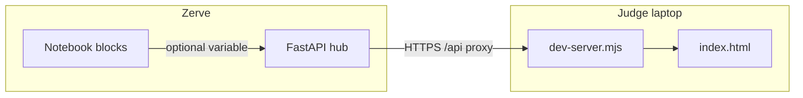

# Fuel Fault Lines

**Irish county energy vulnerability, one scenario at a time** — a judge-ready dashboard and **Zerve-native FastAPI hub** that turns public energy and deprivation signals into an explorable, exportable model. Built for the **Zerve AI Hackathon** ([ZerveHack on Devpost](https://zervehack.devpost.com)): notebook-grade analytics, **deployed as an API**, consumed by a **zero-build** web UI.

---

## Why this fits Zerve

| What judges care about | How this project delivers |
|------------------------|-----------------------------|
| **Notebook → production** | Core logic lives in **`api/pipeline.py`** (the same ideas you’d iterate in a Zerve notebook: merges, scores, scenarios). **`api/main.py`** exposes it as a versioned OpenAPI service. |
| **Live data, optional injection** | Startup loads SEAI-style profiles, CSO deprivation, and AA-style price context — with **CSV fallbacks** if the network blips. Optional **`USE_ZERVE_VARIABLE`** + **`zerve.variable(block, var)`** pulls a **live DataFrame** from your deployed notebook instead of rebuilding from code. |
| **A real product surface** | **`index.html`** is a full **multi-page app** (dashboard, scenarios, compare matrices, county register, method lab, demo pack, optional Gemini analyst) — no Webpack, no `npm install`. |
| **CORS-solved local demo** | **`dev-server.mjs`** serves the UI and **proxies `/api/*` → your Zerve hub over HTTPS** so browsers are happy while you hack on `http://127.0.0.1:5500`. |

**Deployed hub (default upstream for local demos):** `https://fuel-ireland.hub.zerve.cloud`  
**Zerve FastAPI guide:** [Notebook → FastAPI on Zerve](https://docs.zerve.ai/guide/notebook-view/deployment/fast-api)

---

## Repository layout (hackathon map)

Use this tree when you zip the repo, write your Devpost “installation”, or point judges to “where the magic is”:

```text
Fuel-Fault/
├── README.md                 # This file — submission story + runbook
├── AGENTS.md                 # Extra notes for AI coding agents (Cursor, etc.)
├── index.html                # Entire frontend: UI, charts, routing, Gemini page
├── favicon.svg               # Brand mark (aligned with in-app logo)
├── dev-server.mjs            # Static server (port 5500) + HTTPS proxy to Zerve hub
└── api/
    ├── main.py               # FastAPI app: routes, lifespan, optional Zerve variable load
    ├── pipeline.py           # Data ingest, model, insights, exports (the “notebook brain”)
    ├── requirements.txt      # Python deps for the hub
    └── .gitignore
```

**Mental model:** `pipeline.py` = *what we compute* · `main.py` = *how the world calls it* · `index.html` = *how humans explore it* · `dev-server.mjs` = *how you demo it locally without CORS pain*.



---

## One-liner pitch (Devpost / video cold open)

> **Fuel Fault Lines** maps **26 Irish counties** through a **liquid-fuel price scenario** and a transparent vulnerability index — with **charts**, **A/B compare**, **markdown exports**, a **submission pack** endpoint for hackathon copy, and an optional **Gemini** policy chat — all backed by a **Zerve-deployable FastAPI** service and **no database** (in-memory model).

---

## Features (what to show in 2 minutes)

- **Dashboard** — National at-a-glance stats, scenario curve, tier mix, stress over time, bubble and donut views; refreshes when you move the fuel price.
- **Scenarios** — Single **€/L** slider or **compare A vs B**; drives a **single batch** `GET /counties?fuel_price=…` load where the hub supports it.
- **Compare** — Matrix-style exploration (charts + table).
- **Counties** — Full register, **modal deep-dive**, TD / comms hooks when the API provides them.
- **Method & lab** — Lineage, validation, sensitivity, claims, curves, OpenAPI link — *trust layer for judges*.
- **Demo & submit** — Pulls **`GET /insights/submission-pack`** when deployed (Devpost draft, shot list, social draft, rubric hooks).
- **AI · Gemini** — Browser-side **Google Generative Language API**; key stays in the browser (`localStorage`), **not** sent to our FastAPI.

---

## Quick start (judges & teammates)

### 1) Frontend + cloud hub (fastest path)

```bash
node dev-server.mjs
```

Open **http://127.0.0.1:5500/** — by default, **`/api/*`** is proxied to **`https://fuel-ireland.hub.zerve.cloud`**.

Point at **your** hub:

```bash
UPSTREAM_HOST=your-project.hub.zerve.cloud node dev-server.mjs
```

Optional: **`PORT`**, **`HOST`** (see `dev-server.mjs`).

**Do not open `index.html` via `file://`** — API and proxy behaviour expect a real origin.

### 2) Local FastAPI (full stack on your machine)

```bash
cd api
pip install -r requirements.txt
uvicorn main:app --host 0.0.0.0 --port 8000
```

First boot may **fetch external datasets**; unreachable sources fall back to **bundled data** (a few seconds is normal).

**Point the UI at local API:** before reload, in the browser console:

```js
window.__FFL_API_BASE__ = 'http://127.0.0.1:8000';
```

Reload. (The UI normalises bases; trailing `/api` is stripped if you pasted a proxy-style URL.)

---

## Zerve deployment notes (the flex)

1. **Iterate** in a Zerve notebook (e.g. block **`warmer_homes_roi`**, variable **`warmer_homes_df`** — names match the defaults in `api/main.py`).
2. **Deploy** this repo’s **`api/`** as a **FastAPI** app on Zerve (same pattern as Zerve’s official FastAPI deployment guide).
3. **Optional live notebook path:** set environment variables on the hub:
   - **`USE_ZERVE_VARIABLE=1`**
   - **`ZERVE_DATA_BLOCK`** / **`ZERVE_DATA_VAR`** (defaults: `warmer_homes_roi` / `warmer_homes_df`)

Then the hub’s lifespan loads the DataFrame via **`zerve.variable(...)`** instead of rebuilding only from `pipeline.py` — *your notebook becomes the source of truth*.

---

## API surface (summary)

Interactive docs: **`GET /docs`** on whatever host you run (`localhost:8000` or `*.hub.zerve.cloud`).

OpenAPI **tags** (see `api/main.py`): **core** · **county** · **scenario** · **model** · **insights** · **export**

| Area | Example routes |
|------|----------------|
| **Health & meta** | `/health`, `/meta` |
| **County data** | `/counties`, `/county/{county}`, `/deep-dive/{county}`, `/compare/counties` |
| **Scenarios** | `/scenario`, `/history`, `/model/scenario-curve` |
| **Model rigour** | `/model/validation`, `/model/claims`, `/model/sensitivity`, `/model/ranking-stability`, `/model/distribution`, `/model/breach-prices`, `/model/policy` |
| **Insights** | `/national/snapshot`, `/insights/narrative`, `/insights/headline`, `/insights/regional`, **`/insights/submission-pack`** |
| **Exports** | `/export/county/{county}`, `/export/briefing` |
| **Tuning** | `POST /model/params` (session-local; see OpenAPI for behaviour with Zerve variable mode) |

Exact payloads depend on the hub version you attach; **`/docs`** is the source of truth.

**Batch load note:** the UI’s primary path expects a hub that implements **`GET /counties?fuel_price=…`** with a **batch payload** (aggregate fields + `counties[]`). The in-repo **`api/main.py`** also exposes a **name-list** `GET /counties` for bootstrapping — for full dashboard parity with the cloud hub, run or deploy the **batch-capable** hub you intend to demo.

---

## AI (Google Gemini)

The **AI · Gemini** page calls **`generativelanguage.googleapis.com`** from the **browser** with a key you paste in the UI (stored in **`localStorage`** as **`ffl_gemini_key`**). That key is **never** sent to Fuel Fault Lines FastAPI.

Get a key: [Google AI Studio](https://aistudio.google.com/apikey). Default model id in the page is **`gemini-2.5-flash`** (adjust in `index.html` if your key requires another model).

---

## Data & honesty (read before tweeting the numbers)

- **Sources:** SEAI-style domestic energy profiles (with **gov.ie / ArcGIS fallbacks**), **CSO** deprivation cube, **AA Ireland**-style liquid fuel snapshot — surfaced in-app and in **`/meta`**.
- **No database** — everything is **in-memory** per process.
- **Synthetic income bands** and **proxies** stand in where survey microdata is not wired in. Outputs are **scenario illustrations** for policy exploration, **not** official fuel-poverty statistics. **`/meta`**, exports, and the Method page spell this out — *we’d rather lose a headline than mislead a policymaker*.

---

## Development / repo hygiene

| Fact | Detail |
|------|--------|
| **No `package.json`** | `dev-server.mjs` uses **Node built-ins only**. |
| **No frontend build** | Ship **`index.html`** as-is behind any static host or Zerve static surface. |
| **No bundled automated tests** | Manual + `/docs` + the live UI are the current test story. |
| **Agent hints** | See **`AGENTS.md`** for ports, proxy behaviour, and Cursor-oriented notes. |

---

## Hackathon checklist (quick)

- [ ] **Live demo URL** — Zerve hub + static UI, or `dev-server.mjs` + default upstream.
- [ ] **Video** — 2 min: scenario slider → county modal → Method claims → Demo & submit pack → optional Gemini.
- [ ] **Devpost** — use **`/insights/submission-pack`** text where available; link this repo and **`/docs`**.
- [ ] **Social** — tag **@Zerve** / hackathon hashtag from official Devpost rules.

---

## Links

| Resource | URL |
|----------|-----|
| **ZerveHack (Devpost)** | https://zervehack.devpost.com |
| **Zerve FastAPI deployment** | https://docs.zerve.ai/guide/notebook-view/deployment/fast-api |
| **Google AI Studio (Gemini keys)** | https://aistudio.google.com/apikey |

---

**Fuel Fault Lines** — *fault lines aren’t just geology; they’re who gets cold when the price moves.*
