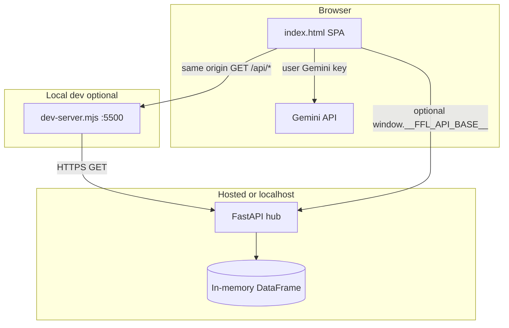
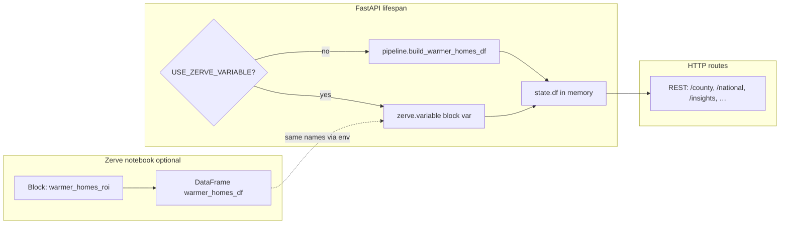
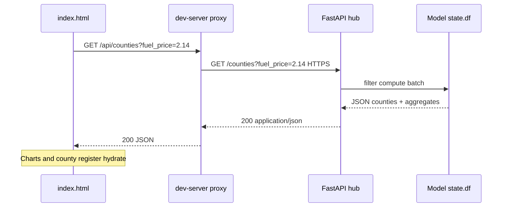

# Fuel Fault Lines

**Irish county energy stress, made explorable.** Fuel Fault Lines is a decision-support surface for **liquid-fuel vulnerability** across **twenty-six counties**: one transparent model, many **€/L price scenarios**, and outputs you can **inspect, compare, and export**—without treating policy trade-offs as a single headline number.

---

## What this project is

Fuel Fault Lines combines:

- **Public-style signals** — SEAI-oriented energy profiles, CSO deprivation structure, and a retail **diesel / heating-oil** price lever (€ per litre), merged into a **single in-memory cohort** (no database).
- **A vulnerability index and tiering** — So you can see *who sits where* in the distribution, not only national averages.
- **Scenario behaviour** — Move the price (or compare **A vs B**), watch **counties over a modelled fuel-share-of-income line**, **scenario curves**, and **national snapshots** update together.
- **An OpenAPI hub** — The same numbers power the **browser app** and any **script, notebook, or integration** that speaks HTTP.

The frontend is a **single static file** (`index.html`): charts, multi-page navigation, county register, optional **Gemini** copilot (your key, in the browser only). The backend is **FastAPI** (`api/`): one canonical **pandas** `DataFrame` drives every route, rebuilt or injected at startup depending on how you deploy.

---

## Why it exists

Ireland still has a **meaningful liquid-fuel heated stock** and a geography of **income and building condition** that does not line up evenly. Policy and advocacy conversations often jump between **retail price shocks**, ** retrofit costs**, and **social protection**—without a **shared, repeatable object** that lets people ask: *at this €/L, where does the modelled burden cross a line we can defend, and which counties move first?*

Fuel Fault Lines was built to:

1. **Make assumptions visible** — Thresholds, proxies, and data lineage are surfaced in **`/meta`**, exports, and the app’s connection to the live model—not buried in a one-off spreadsheet.
2. **Support “what if” without hero charts** — **Scenarios** and **Compare** are first-class: the point is to stress-test a *story* (“€2.14 vs €2.60”) rather than decorate a single forecast.
3. **Bridge analysts and communicators** — **Markdown exports** (`/export/briefing`, `/export/county/...`) and narrative endpoints (`/insights/*`) turn the same core table into **briefing fragments** a human can edit—useful for internal notes, TD letters, or team alignment (always subject to the documented limitations below).

It is **not** a replacement for official fuel-poverty statistics. It is a **structured sandbox** for **exploration and alignment** when liquid-fuel prices move and counties do not react the same way.

---

## How people use it day to day

These are the workflows the UI and API are shaped around—whether you open the app once a week or wire the hub into your own tooling.

### Morning or “price moved” check

1. Open **Dashboard** — National chips, **scenario curve**, and **key finding** text reflect the **active €/L** (driven from **Scenarios**).
2. Nudge the **Scenarios** slider after a wholesale or forecourt move — The app refetches county rows for that price so **tiers**, **register stress colours**, and **charts** stay coherent with the same definition of “fuel share of income” everywhere.

### Comparing two futures (A vs B)

On **Scenarios**, switch to **compare mode**, set **A** and **B**, run the comparison — The **Counties** register and compare views highlight **who crosses the line** between the two prices. That is the everyday question: *not only “how bad is it now?” but “how many places tip if we add €0.20?”*

### Drilling into one county

From **Counties**, open a county — **Deep metrics**, modal detail, and (when the hub supports them) **export** links give you a **portable slice** for a constituency or supplier discussion without re-implementing the pipeline.

### Earning trust before you cite numbers

Use **Compare** for **matrix-style views** (charts + table) over **model diagnostics** where exposed—validation, sensitivity, ranking stability—so “impressive headline” does not outrun **internal consistency**. When something fails (502, partial load), the **connection pill** and notices tell you whether you are looking at **live hub data** or **Settings → demo mode** sample data.

### Optional analyst chat (**AI · Gemini**)

If you add a key from [Google AI Studio](https://aistudio.google.com/apikey), each message is sent with a **fresh bundle of live context** (national snapshot, headline, meta, county digest from what the UI already loaded). The model is instructed **not to invent** county statistics when the hub is down—so the chat stays **subordinate to the API**, not the other way around.

### Integrators and report writers

Anything the UI does, you can call from **curl**, **Python**, or a **notebook**: **`GET /docs`** on your running hub lists routes. **`GET /insights/submission-pack`** returns a **structured JSON scaffold** (summary draft, checklists, social-length copy, rubric-style bullets)—handy as **raw material** for comms or documentation, not as an authoritative statistic.

---

## Architecture

At runtime there are **three cooperating layers**: the **browser UI**, the **model API** (local or hosted), and **Google Gemini** (optional, browser-only—keys never hit FastAPI).



- **Typical local use:** `node dev-server.mjs` → UI at **http://127.0.0.1:5500**, `fetch` hits **`/api/*`**, which the dev server **proxies over HTTPS** to your configured upstream hub (see `UPSTREAM_HOST` in `dev-server.mjs` and defaults in `index.html`).
- **Full stack on your laptop:** run **uvicorn** on port **8000**, then point the UI with **`?api=http://127.0.0.1:8000`**, **`localStorage` `ffl_api_base`**, or `window.__FFL_API_BASE__` before loads (see Quick start).

**Do not open `index.html` via `file://`** — the app expects a real origin for `fetch`, CORS, and optional proxy behaviour.

---

## Notebook-shaped core → FastAPI hub

The service is structured so **one canonical DataFrame** (internally the `warmer_homes_df` shape) powers **every** JSON and markdown response. That keeps **dashboard**, **exports**, and **validation** aligned.



| Variable | Purpose |
|----------|---------|
| `USE_ZERVE_VARIABLE=1` | Load the model DataFrame via **`zerve.variable(...)`** from a deployed Zerve notebook instead of rebuilding only from `pipeline.py`. |
| `ZERVE_DATA_BLOCK` | Notebook block title (default `warmer_homes_roi`). |
| `ZERVE_DATA_VAR` | Variable name (default `warmer_homes_df`). |

**Code anchors:** `api/main.py` (`lifespan`, `_load_warmer_homes_df`) and `api/pipeline.py` (ingest, scores, insights, exports). For Zerve’s **notebook → FastAPI** deployment story, see the [Zerve FastAPI guide](https://docs.zerve.ai/guide/notebook-view/deployment/fast-api).

---

## Request flow (example: loading counties)

What happens when the UI loads **all counties** for a given **€/L** (e.g. dashboard after a slider change):



The **AI · Gemini** path is separate: before each reply, the UI **GETs** snapshot/headline/meta (as available) and attaches a **county digest** from data already in memory—so answers stay **grounded in the same model state** you are looking at.

---

## Repository layout

```text
Fuel-Fault/
├── README.md              # Project overview (this file)
├── AGENTS.md              # Concise notes for tooling / AI agents (ports, proxy)
├── index.html             # Full frontend: UI, charts, routing, optional Gemini
├── assets/                # Brand mark + favicon
├── dev-server.mjs         # Static host + /api HTTPS proxy (Node built-ins only)
└── api/
    ├── main.py            # FastAPI: routes, CORS, lifespan, optional Zerve variable
    ├── pipeline.py        # Data ingest, model, insights, exports
    ├── requirements.txt
    └── .gitignore
```

**Mental model:** `pipeline.py` = *what we compute* · `main.py` = *how the world calls it* · `index.html` = *how humans explore it* · `dev-server.mjs` = *local demo without CORS friction*.

---

## Product surface (what ships in the UI)

| Area | Role in everyday use |
|------|----------------------|
| **Dashboard** | National at-a-glance, **scenario curve**, tier and stress visuals; updates with the active price. |
| **Scenarios** | Single **€/L** slider or **compare A vs B**; drives refetch and live strip numbers. |
| **Compare** | Matrix-style charts + table for **multi-metric** comparison. |
| **Counties** | Sortable register, **modal deep-dive**, export entry points when the hub exposes them. |
| **Settings** | **Demo mode** vs live API base; reload to apply. |
| **AI · Gemini** | Optional Q&A with **live hub context** per message; key stays in the browser. |

---

## Quick start

### Frontend + remote hub

```bash
node dev-server.mjs
```

Open **http://127.0.0.1:5500/**. Override upstream:

```bash
UPSTREAM_HOST=your-project.hub.zerve.cloud node dev-server.mjs
```

Optional: **`PORT`**, **`HOST`** (see `dev-server.mjs`).

### Local FastAPI

```bash
cd api
pip install -r requirements.txt
uvicorn main:app --host 0.0.0.0 --port 8000
```

First boot may **fetch external datasets**; failures fall back to **bundled data** (a few seconds is normal).

**Point the UI at local API** (pick one):

- **URL:** `http://127.0.0.1:5500/?api=http://127.0.0.1:8000`
- **Persist:** `localStorage.setItem('ffl_api_base', 'http://127.0.0.1:8000')` then reload.

---

## API surface (summary)

Interactive contracts: **`GET /docs`** on the running hub.

| Area | Examples |
|------|----------|
| **Health & meta** | `/health`, `/meta` |
| **County data** | `/counties`, `/county/{county}`, `/deep-dive/{county}`, `/compare/counties` |
| **Scenarios** | `/scenario`, `/history`, `/model/scenario-curve` |
| **Model rigour** | `/model/validation`, `/model/claims`, `/model/sensitivity`, `/model/ranking-stability`, `/model/distribution`, `/model/breach-prices`, `/model/policy` |
| **Insights** | `/national/snapshot`, `/insights/narrative`, `/insights/headline`, `/insights/regional`, `/insights/submission-pack` |
| **Exports** | `/export/county/{county}`, `/export/briefing` |
| **Tuning** | `POST /model/params` (see OpenAPI; interacts with Zerve variable mode when enabled) |

**Batch note:** the dashboard’s happy path expects a **batch-style** `GET /counties?fuel_price=…` response (county rows plus aggregates). If you run a minimal fork, confirm parity with **`/docs`** on your deployment.

---

## Data & limitations (read before citing)

- **Sources:** SEAI-style profiles (with gov.ie / ArcGIS fallbacks), **CSO** deprivation inputs, **AA Ireland**-style liquid-fuel reference — surfaced in **`/meta`** and in-app copy where available.
- **No database** — **in-memory** per process; restart clears state except what you persist externally.
- **Proxies and synthetic bands** stand in where full survey microdata is not wired. Treat outputs as **scenario illustrations for policy exploration**, not official fuel-poverty statistics. **`/meta`**, exports, and in-app notices document lineage and caveats.

---

## Development facts

| Fact | Detail |
|------|--------|
| **No `package.json`** | `dev-server.mjs` uses **Node built-ins only**. |
| **No frontend build** | Ship **`index.html`** on any static host. |
| **Icons** | [Lucide](https://lucide.dev) via CDN reference in `index.html`. |
| **Automated tests** | Not configured; validate via **`/docs`** and manual UI passes. |
| **Agent-oriented notes** | **`AGENTS.md`** |

---

## Links

| Resource | URL |
|----------|-----|
| **Zerve — FastAPI deployment** | https://docs.zerve.ai/guide/notebook-view/deployment/fast-api |
| **Google AI Studio (Gemini keys)** | https://aistudio.google.com/apikey |

---

**Fuel Fault Lines** — *fault lines are not only geological; they are who gets squeezed when the price moves.*
