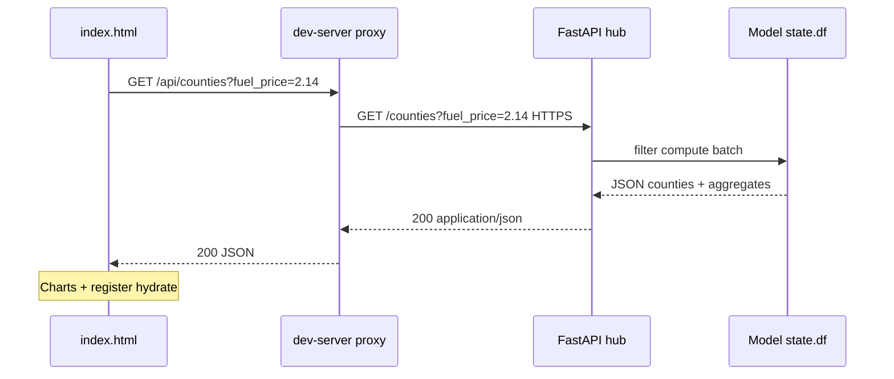

# Fuel Fault Lines

**Irish county energy vulnerability — one liquid-fuel scenario at a time.** A judge-ready **dashboard + OpenAPI hub** that turns public energy and deprivation signals into an explorable, exportable model. Built for **[ZerveHack](https://zervehack.devpost.com/)** — *Stop thinking about it. Build it.* — the Zerve AI hackathon with **$10,000 in prizes** (deadline **Apr 29, 2026 @ 2:00pm EDT** per [Devpost](https://zervehack.devpost.com/)).

---

## Hackathon submission at a glance

| Devpost requirement | Where it lives in this repo |
|---------------------|-----------------------------|
| **Public Zerve project** | Deploy `api/` as **FastAPI** on Zerve; notebook block names align with optional `zerve.variable(...)` injection (see [Zerve deployment](#zerve-notebook--fastapi-how-the-hub-connects)). |
| **Project summary (≤300 words)** | Use **`GET /insights/submission-pack`** — the **Demo & submit** page loads a draft summary, shot list, social copy, and rubric hooks. |
| **Demo video (≤3 min)** | Walk through: Dashboard → Scenarios (€/L) → Counties deep-dive → Method & lab (`/meta`, validation) → Demo & submit pack → optional **AI · Gemini** copilot grounded in live API data. |
| **Share (LinkedIn / X)** | Tag **@Zerve AI** / **@Zerve_AI** per hackathon rules; link your deployed `*.hub.zerve.cloud` + this repo. |
| **Bonus: deployed API** | Primary story: **Zerve-hosted FastAPI** + **zero-build** static UI (`index.html`). |

**Deployed demo hub (default for local UI proxy):** `https://26db1629-947d4286.hub.zerve.cloud`  
**Zerve FastAPI guide:** [Notebook → FastAPI on Zerve](https://docs.zerve.ai/guide/notebook-view/deployment/fast-api)

---

## One-liner pitch (video cold open)

> **Fuel Fault Lines** maps **26 Irish counties** through a **retail diesel / heating-oil proxy (€/L)** and a transparent **vulnerability index** — with **charts**, **A/B scenarios**, **markdown exports**, a **submission-pack** endpoint for Devpost copy, and an optional **Gemini** copilot that **reads live hub data** before answering — all backed by a **Zerve-deployable FastAPI** service and **no database** (in-memory model).

---

## Why ZerveHack judges should care

The [ZerveHack judging criteria](https://zervehack.devpost.com/) emphasize depth, end-to-end workflow, clarity, and ambition. This project maps to them deliberately:

| Criterion | Weight | How Fuel Fault Lines responds |
|-----------|--------|-------------------------------|
| **Analytical depth** | 35% | County-level **fuel share of income** proxy, **tiering**, **national snapshot**, **scenario curves**, **breach prices**, **ranking stability**, **sensitivity** — not a single chart and done. See **Method & lab** in the UI and **`/model/*`** routes. |
| **End-to-end workflow** | 30% | **Notebook-shaped logic** in `api/pipeline.py` → **production FastAPI** in `api/main.py` → **real browser product** in `index.html`. Optional **`USE_ZERVE_VARIABLE`** wires the **live Zerve notebook DataFrame** into the same API. |
| **Storytelling & clarity** | 20% | Multi-page UI, **exports** (`/export/briefing`, `/export/county/...`), **submission-pack** for hackathon narrative, **meta/lineage** for trust. |
| **Creativity & ambition** | 15% | **Climate & energy** relevance (Ireland, liquid fuels, vulnerability), **policy hooks** (TD templates where data allows), **Gemini copilot** with **per-message refresh** of snapshot + headline + county digest. |

---

## Architecture (system overview)

At runtime there are **three cooperating layers**: the **browser UI**, the **model API** (local or Zerve), and **Google Gemini** (optional, browser-only — keys never hit our FastAPI).


- **Normal local demo:** `node dev-server.mjs` → UI at `http://127.0.0.1:5500`, API calls go to **`/api`** → proxied to **`https://26db1629-947d4286.hub.zerve.cloud`** (override with env `UPSTREAM_HOST`).
- **Full stack local:** run `uvicorn` on port 8000, then either open **`http://127.0.0.1:5500/?api=http://127.0.0.1:8000`**, or run `localStorage.setItem('ffl_api_base','http://127.0.0.1:8000')` and reload, or set `window.__FFL_API_BASE__` before the app script (see [Quick start](#quick-start-judges--teammates)).

---

## Zerve notebook → FastAPI (how the hub connects)

The FastAPI app is designed for Zerve’s **notebook → deploy** story. Core idea: **one canonical DataFrame** (`warmer_homes_df` shape) powers every route.

```mermaid
flowchart LR
  subgraph notebook [Zerve notebook optional]
    B1[Block: warmer_homes_roi]
    DF[DataFrame warmer_homes_df]
    B1 --> DF
  end
  subgraph startup [FastAPI lifespan]
    ENV{USE_ZERVE_VARIABLE?}
    ZV[zerve.variable block var]
    PL[pipeline.build_warmer_homes_df]
    STATE[state.df in memory]
    ENV -->|yes| ZV
    ENV -->|no| PL
    ZV --> STATE
    PL --> STATE
  end
  subgraph routes [HTTP routes]
    R1[/county /national /insights ...]
    STATE --> R1
  end
  DF -.->|same names via env| ZV
```

**Environment variables** (on the Zerve deployment):

| Variable | Purpose |
|----------|---------|
| `USE_ZERVE_VARIABLE=1` | Load the model DataFrame via **`zerve.variable(...)`** instead of rebuilding only from `pipeline.py`. |
| `ZERVE_DATA_BLOCK` | Notebook block title (default `warmer_homes_roi`). |
| `ZERVE_DATA_VAR` | Variable name (default `warmer_homes_df`). |

**Code anchors:** `api/main.py` (`_load_warmer_homes_df`, `lifespan`) and `api/pipeline.py` (ingest, scores, insights, exports).

---

## Request flow (example: dashboard load)

What happens when a judge opens the app and the UI fetches counties for the current €/L scenario:



The **AI · Gemini** page adds a parallel path: before each reply, the UI **GETs** `/national/snapshot`, `/insights/headline`, `/meta`, and merges an in-memory **county digest** into the **Gemini system instruction** — so the **knowledge layer** stays tied to the **data layer**.

---

## Repository layout

```text
Fuel-Fault/
├── README.md              # This file — submission narrative + architecture
├── AGENTS.md              # Notes for AI coding agents (ports, proxy, endpoints)
├── index.html             # Full frontend: UI, charts, routing, Lucide icons, AI copilot
├── favicon.svg            # Brand mark (zap / energy)
├── dev-server.mjs         # Static host + /api HTTPS proxy (optional 502 retry)
└── api/
    ├── main.py            # FastAPI: routes, CORS, lifespan, optional Zerve variable
    ├── pipeline.py        # Data ingest, model, insights, exports (“notebook brain”)
    ├── requirements.txt
    └── .gitignore
```

**Mental model:** `pipeline.py` = *what we compute* · `main.py` = *how the world calls it* · `index.html` = *how humans explore it* · `dev-server.mjs` = *how you demo without CORS pain*.

---

## Features (demo script checklist)

- **Dashboard** — At-a-glance stats, scenario curve, tier bars, stress over time, bubble + donut views; updates with fuel price.
- **Scenarios** — Single **€/L** slider or **compare A vs B**; batch `/counties?fuel_price=…` where the hub supports it.
- **Compare** — Matrix-style charts + table.
- **Counties** — Full register, modal **deep-dive**, exports when available.
- **Method & lab** — Lineage, validation, sensitivity, claims, curves — **trust layer** for judges.
- **Demo & submit** — **`GET /insights/submission-pack`** (Devpost draft, shot list, social, rubric hooks).
- **AI · Gemini** — Browser-side [Google AI Studio](https://aistudio.google.com/apikey) key; **live hub context** injected each message (snapshot, headline, meta, county digest). Key is **not** sent to FastAPI.

---

## Quick start (judges & teammates)

### 1) Frontend + cloud hub (fastest path)

```bash
node dev-server.mjs
```

Open **http://127.0.0.1:5500/** — by default **`/api/*`** proxies to **`https://26db1629-947d4286.hub.zerve.cloud`** (same default as `API_PUBLIC` in `index.html`).

Point at **your** hub:

```bash
UPSTREAM_HOST=your-project.hub.zerve.cloud node dev-server.mjs
```

Optional: **`PORT`**, **`HOST`** (see `dev-server.mjs`).

**Do not open `index.html` via `file://`** — the UI expects a real origin for `fetch` and proxy behaviour.

### 2) Local FastAPI (full stack)

```bash
cd api
pip install -r requirements.txt
uvicorn main:app --host 0.0.0.0 --port 8000
```

First boot may **fetch external datasets**; failures fall back to **bundled data** (a few seconds is normal).

**Point the UI at local API** (pick one):

- **URL (one-shot):** open `http://127.0.0.1:5500/?api=http://127.0.0.1:8000` (the `<head>` bootstrap sets `window.__FFL_API_BASE__` before the app runs).
- **Persist:** in the console run `localStorage.setItem('ffl_api_base', 'http://127.0.0.1:8000')` then reload.
- **Manual:** set `window.__FFL_API_BASE__ = 'http://127.0.0.1:8000'` in the console and reload (must run before fetches; prefer the options above).

---

## API surface (summary)

Interactive docs: **`GET /docs`** on your hub host.

| Area | Example routes |
|------|----------------|
| **Health & meta** | `/health`, `/meta` |
| **County data** | `/counties`, `/county/{county}`, `/deep-dive/{county}`, `/compare/counties` |
| **Scenarios** | `/scenario`, `/history`, `/model/scenario-curve` |
| **Model rigour** | `/model/validation`, `/model/claims`, `/model/sensitivity`, `/model/ranking-stability`, `/model/distribution`, `/model/breach-prices`, `/model/policy` |
| **Insights** | `/national/snapshot`, `/insights/narrative`, `/insights/headline`, `/insights/regional`, **`/insights/submission-pack`** |
| **Exports** | `/export/county/{county}`, `/export/briefing` |
| **Tuning** | `POST /model/params` (see OpenAPI; behaviour interacts with Zerve variable mode) |

Exact payloads: **`/docs`** on the running hub.

**Batch load note:** the UI’s primary path expects **`GET /counties?fuel_price=…`** with a **batch payload** (`counties[]` + aggregates). The in-repo `api/main.py` may expose a **name-list** `GET /counties` for bootstrapping — for full dashboard parity with a cloud hub, deploy the **batch-capable** hub you intend to demo.

---

## AI copilot (Gemini + live data)

- **Data (Zerve / FastAPI):** Each send refreshes **national snapshot**, **headline insight**, **meta** (or cache), and a **county digest** from data already loaded in the UI.
- **Knowledge (Gemini):** [Generative Language API](https://ai.google.dev/) from the **browser** only; key stored in **`localStorage`** (`ffl_gemini_key`). Default model id in `index.html`: **`gemini-2.5-flash`** (change if your key requires another model).

---

## Data & limitations (read before citing numbers)

- **Sources:** SEAI-style profiles (with gov.ie / ArcGIS fallbacks), **CSO** deprivation cube, **AA Ireland**-style liquid fuel snapshot — surfaced in-app and in **`/meta`**.
- **No database** — **in-memory** per process.
- **Synthetic income bands** and **proxies** stand in where survey microdata is not wired. Outputs are **scenario illustrations** for policy exploration, **not** official fuel-poverty statistics. **`/meta`**, exports, and the Method page document lineage and caveats.

---

## Development facts

| Fact | Detail |
|------|--------|
| **No `package.json`** | `dev-server.mjs` uses **Node built-ins only**. |
| **No frontend build** | Ship **`index.html`** as-is on any static host. |
| **Icons** | [Lucide](https://lucide.dev) via pinned CDN in `index.html`. |
| **Tests** | Manual + `/docs` + live UI. |
| **Agent hints** | **`AGENTS.md`** |

---

## Links

| Resource | URL |
|----------|-----|
| **ZerveHack (Devpost)** | https://zervehack.devpost.com/ |
| **Zerve — FastAPI deployment** | https://docs.zerve.ai/guide/notebook-view/deployment/fast-api |
| **Google AI Studio (Gemini)** | https://aistudio.google.com/apikey |

---

**Fuel Fault Lines** — *fault lines aren’t only geology; they’re who gets cold when the price moves.*
